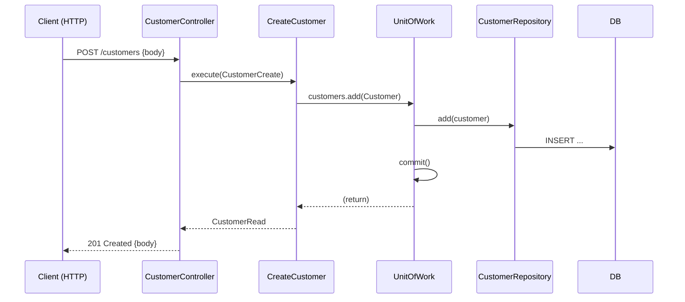
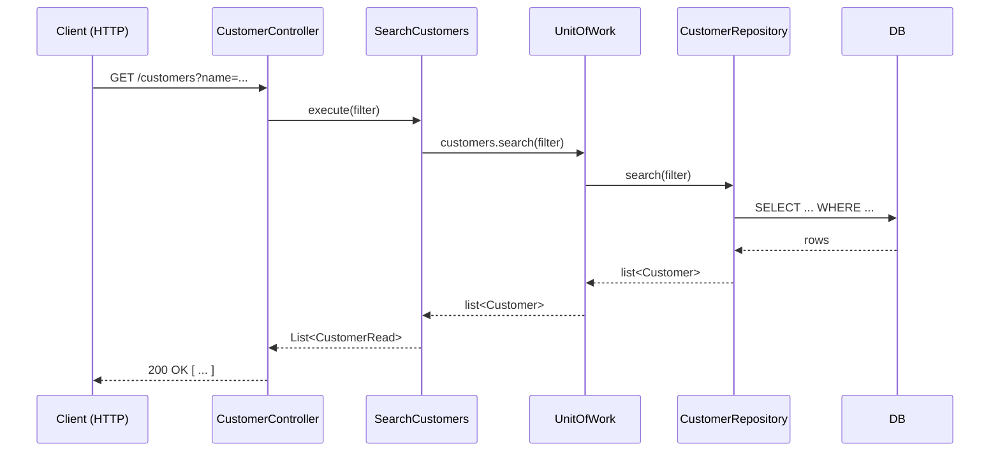

# API de Clientes — Design & UML (Mermaid corrigido) ✅

**Objetivo:** Documentar a arquitetura e o design para uma API de Clientes (cadastrar, deletar, atualizar, pesquisar) aplicando **FastAPI + Pydantic**, **SOLID**, **OOP**, **DRY**, **Ports & Adapters** e **Unit of Work**.

---

## 📋 Resumo rápido
- Use cases: Create, Update, Delete, Get, Search
- Arquitetura: Ports & Adapters (Hexagonal) + Unit of Work para transações
- Principais camadas: API (FastAPI), UseCases, Domain (entities), Ports (interfaces), Adapters (persistence)

---

## 📦 Estrutura proposta (Ports & Adapters + Versionamento Híbrido)

```
src/
  ├── core/                           # Código compartilhado (não versiona)
  │   ├── __init__.py
  │   ├── exceptions.py
  │   ├── config.py
  │   └── utils.py
  ├── domain/                         # Entidades e regras (não versiona)
  │   ├── __init__.py
  │   ├── entities/
  │   │   ├── __init__.py
  │   │   └── customer.py
  │   ├── value_objects/
  │   │   ├── __init__.py
  │   │   ├── email.py
  │   │   └── phone.py
  │   └── exceptions.py
  ├── adapters/                       # Implementações (não versiona)
  │   ├── __init__.py
  │   └── persistence/
  │       ├── __init__.py
  │       └── sqlalchemy/
  │           ├── __init__.py
  │           ├── models.py
  │           ├── repositories.py
  │           └── unit_of_work.py
  ├── api/                            # VERSIONADO
  │   ├── v1/
  │   │   ├── __init__.py
  │   │   └── routes/
  │   │       ├── __init__.py
  │   │       └── customer.py
  │   └── v2/
  │       └── routes/
  ├── schemas/                        # DTOs VERSIONADOS
  │   ├── v1/
  │   │   ├── __init__.py
  │   │   ├── customer.py
  │   │   └── base.py
  │   └── v2/
  │       └── ...
  ├── usecases/                       # Use Cases VERSIONADOS
  │   ├── ports/                      # Interfaces (Ports) próximas aos UseCases
  │   │   ├── repositories.py
  │   │   └── unit_of_work.py
  │   ├── v1/
  │   │   ├── __init__.py
  │   │   ├── base.py
  │   │   └── customers/
  │   │       ├── __init__.py
  │   │       ├── create_customer.py
  │   │       ├── update.py
  │   │       ├── delete.py
  │   │       ├── get.py
  │   │       └── search.py
  │   └── v2/
  │       └── ...
  └── main.py                         # FastAPI app + blueprint versionado
```

**Estratégia de Versionamento Híbrida:**
- ✅ **Não versiona:** `domain/`, `ports/`, `adapters/` (raramente mudam, compartilhadas)
- ✅ **Versiona:** `api/`, `schemas/`, `usecases/` (evoluem com a API)
- ✅ **Compartilhado:** `core/` (helpers, config, exceções globais)

---

## 🏛️ Entity vs Value Object — Clarificação

### **Entity (Entidade)** — Objetos com Identidade
- Tem um **ID único** que a identifica
- **Mutável** — pode mudar ao longo do tempo
- Persiste no banco de dados
- Igualdade comparada por **ID**
- Exemplos: `Customer`, `Order`, `Invoice`

### **Value Object** — Objetos de Valor
- **Sem identidade própria**
- **Imutável** — nunca muda após criação
- Compõe uma Entity
- Igualdade comparada por **valor**
- Pode ser reutilizado em múltiplas Entities
- Exemplos: `Email`, `Phone`, `Money`, `Address`

**Benefícios da separação:**

✅ Validações encapsuladas no Value Object  
✅ Reusabilidade — `Email` pode ser usada em Customer, Order, etc.  
✅ Imutabilidade reduz bugs  
✅ Testes mais isolados e focados

---

## UML de Classes (Mermaid) 🔧
Abaixo está o diagrama de classes em **Mermaid** refletindo a arquitetura **Ports & Adapters** (Hexagonal) com **Entities e Value Objects separados**:

```mermaid
classDiagram
    direction TB

    %% ===== DOMAIN LAYER =====
    %% ===== ENTITIES =====
    class Customer {
        -UUID id
        -String name
        -Email email (Value Object)
        -Phone phone (Value Object)
        -DateTime created_at
        -DateTime updated_at
        --
        +change_email(new_email_str: str) void
        +change_phone(new_phone_str: str) void
        +__eq__(other) bool
    }

    %% ===== VALUE OBJECTS =====
    class Email {
        <<Value Object - Imutável>>
        -String value
        --
        -validate_format(value) bool
        +__eq__(other) bool
        +__hash__() int
        +__str__() str
    }

    class Phone {
        <<Value Object - Imutável>>
        -String value
        --
        -validate_format(value) bool
        +format_international() str
        +__eq__(other) bool
        +__hash__() int
    }

    %% ===== PORTS LAYER (Interfaces/Protocols) =====
    class ICustomerRepository {
        <<interface>>
        +add(customer: Customer) void
        +get_by_id(id: UUID) Optional~Customer~
        +update(customer: Customer) void
        +delete(id: UUID) void
        +search(filter: dict) List~Customer~
    }

    class IUnitOfWork {
        <<interface>>
        +customers: ICustomerRepository
        +commit() void
        +rollback() void
        +__enter__() IUnitOfWork
        +__exit__() void
    }

    %% ===== ADAPTERS LAYER =====
    class SQLAlchemyCustomerRepository {
        -Session session
        --
        +add(customer: Customer) void
        +get_by_id(id: UUID) Optional~Customer~
        +update(customer: Customer) void
        +delete(id: UUID) void
        +search(filter: dict) List~Customer~
    }

    class SQLAlchemyUnitOfWork {
        -Session session
        -SQLAlchemyCustomerRepository _customers
        --
        +customers: ICustomerRepository
        +commit() void
        +rollback() void
    }

    class CustomerModel {
        <<SQLAlchemy Model>>
        +id: UUID
        +name: str
        +email: str
        +phone: str
        +created_at: datetime
        +updated_at: datetime
    }

    %% ===== USE CASES LAYER =====
    class CreateCustomer {
        -IUnitOfWork uow
        --
        +execute(dto: CustomerCreate) CustomerRead
    }

    class GetCustomer {
        -IUnitOfWork uow
        --
        +execute(id: UUID) CustomerRead
    }

    class UpdateCustomer {
        -IUnitOfWork uow
        --
        +execute(id: UUID, dto: CustomerUpdate) CustomerRead
    }

    class DeleteCustomer {
        -IUnitOfWork uow
        --
        +execute(id: UUID) void
    }

    class SearchCustomers {
        -IUnitOfWork uow
        --
        +execute(filter: dict, limit: int, offset: int) List~CustomerRead~
    }

    %% ===== API LAYER =====
    class CustomerRouter {
        -CreateCustomer create_uc
        -GetCustomer get_uc
        -UpdateCustomer update_uc
        -DeleteCustomer delete_uc
        -SearchCustomers search_uc
        --
        +post(payload: CustomerCreate) CustomerRead
        +get(id: UUID) CustomerRead
        +put(id: UUID, payload: CustomerUpdate) CustomerRead
        +delete(id: UUID) void
        +get_all(name: str, limit: int, offset: int) List~CustomerRead~
    }

    %% ===== DTO LAYER =====
    class CustomerCreate {
        <<Pydantic Model>>
        +name: str
        +email: str
        +phone: Optional~str~
    }

    class CustomerUpdate {
        <<Pydantic Model>>
        +name: Optional~str~
        +email: Optional~str~
        +phone: Optional~str~
    }

    class CustomerRead {
        <<Pydantic Model>>
        +id: UUID
        +name: str
        +email: str
        +phone: Optional~str~
        +created_at: datetime
    }

    %% ===== RELATIONSHIPS =====
    %% Domain relationships (composition)
    Customer *-- Email : "has 1"
    Customer *-- Phone : "has 1"
    
    %% Port relationships (interfaces)
    ICustomerRepository <|.. SQLAlchemyCustomerRepository : implements
    IUnitOfWork <|.. SQLAlchemyUnitOfWork : implements
    IUnitOfWork o-- ICustomerRepository : composes
    
    %% Adapter relationships
    SQLAlchemyCustomerRepository --> CustomerModel : maps to/from
    SQLAlchemyUnitOfWork --> SQLAlchemyCustomerRepository : contains
    
    %% UseCase relationships (depend on ports, not implementations)
    CreateCustomer --> IUnitOfWork : uses
    GetCustomer --> IUnitOfWork : uses
    UpdateCustomer --> IUnitOfWork : uses
    DeleteCustomer --> IUnitOfWork : uses
    SearchCustomers --> IUnitOfWork : uses
    
    %% UseCase creates domain
    CreateCustomer ..> Customer : creates
    
    %% Router relationships (orchestrates use cases)
    CustomerRouter --> CreateCustomer : invokes
    CustomerRouter --> GetCustomer : invokes
    CustomerRouter --> UpdateCustomer : invokes
    CustomerRouter --> DeleteCustomer : invokes
    CustomerRouter --> SearchCustomers : invokes
    
    %% DTO relationships
    CustomerRouter --> CustomerCreate : receives
    CustomerRouter --> CustomerUpdate : receives
    CustomerRouter --> CustomerRead : returns
    CreateCustomer ..> CustomerRead : returns
    GetCustomer ..> CustomerRead : returns
    UpdateCustomer ..> CustomerRead : returns
    SearchCustomers ..> CustomerRead : returns
```



---

## 🔁 Diagramas de sequência (Mermaid)

### Criar cliente



### Pesquisar clientes



---

## 📝 Exemplo de Value Object — Email (Imutável e Validado)

```python
# src/v1/domain/value_objects/email.py
from dataclasses import dataclass
import re

@dataclass(frozen=True)  # ← Imutável
class Email:
    """Value Object para representar um email válido."""
    value: str

    def __post_init__(self):
        """Valida no construtor — falha rápido se inválido."""
        if not self._is_valid(self.value):
            raise ValueError(f"Email inválido: {self.value}")

    @staticmethod
    def _is_valid(email: str) -> bool:
        pattern = r'^[a-zA-Z0-9._%+-]+@[a-zA-Z0-9.-]+\.[a-zA-Z]{2,}$'
        return re.match(pattern, email) is not None

    def __eq__(self, other):
        """Igualdade por valor, não por ID."""
        if not isinstance(other, Email):
            return False
        return self.value == other.value

    def __hash__(self):
        return hash(self.value)

    def __str__(self):
        return self.value
```

---

## 📝 Exemplo de Entity — Customer (com Identidade)

```python
# src/v1/domain/entities/customer.py
from uuid import UUID
from datetime import datetime
from src.v1.domain.value_objects.email import Email
from src.v1.domain.value_objects.phone import Phone

class Customer:
    """Entity com identidade única e mutável."""
    
    def __init__(
        self,
        id: UUID,
        name: str,
        email: Email,           # ← Value Object (imutável)
        phone: Phone,           # ← Value Object (imutável)
        created_at: datetime,
        updated_at: datetime
    ):
        self.id = id            # ← Identificador único
        self.name = name
        self.email = email
        self.phone = phone
        self.created_at = created_at
        self.updated_at = updated_at

    def change_email(self, new_email_str: str) -> None:
        """Altera email — cria novo Value Object com validação."""
        new_email = Email(new_email_str)  # Valida aqui
        self.email = new_email
        self.updated_at = datetime.now()

    def change_phone(self, new_phone_str: str) -> None:
        """Altera telefone — cria novo Value Object com validação."""
        new_phone = Phone(new_phone_str)  # Valida aqui
        self.phone = new_phone
        self.updated_at = datetime.now()

    def __eq__(self, other):
        """Igualdade por ID (não por valor)."""
        if not isinstance(other, Customer):
            return False
        return self.id == other.id

    def __hash__(self):
        return hash(self.id)
```

---

## ✍️ Exemplos de Pydantic (DTOs)

```python
# src/v1/schemas/customer.py
from pydantic import BaseModel, EmailStr, field_validator
from typing import Optional
from uuid import UUID
from datetime import datetime

class CustomerCreate(BaseModel):
    """DTO para criar um cliente."""
    name: str
    email: EmailStr
    phone: Optional[str] = None

class CustomerUpdate(BaseModel):
    """DTO para atualizar um cliente."""
    name: Optional[str] = None
    email: Optional[EmailStr] = None
    phone: Optional[str] = None

class CustomerRead(BaseModel):
    """DTO para retornar um cliente (resposta da API)."""
    id: UUID
    name: str
    email: EmailStr
    phone: Optional[str]
    created_at: datetime

    @staticmethod
    def from_entity(customer) -> 'CustomerRead':
        """Converte Entity → DTO."""
        return CustomerRead(
            id=customer.id,
            name=customer.name,
            email=str(customer.email),
            phone=str(customer.phone) if customer.phone else None,
            created_at=customer.created_at
        )
```

---

## 🧭 Portas (interfaces) — Tipos/Protocol

```python
# src/v1/ports/repositories.py
from typing import Protocol, Optional, List
from uuid import UUID
from src.domain.entities.customer import Customer

class ICustomerRepository(Protocol):
    """Interface (port) para persistência de clientes."""
    def add(self, customer: Customer) -> None: ...
    def get_by_id(self, id: UUID) -> Optional[Customer]: ...
    def update(self, customer: Customer) -> None: ...
    def delete(self, id: UUID) -> None: ...
    def search(self, filter: dict) -> List[Customer]: ...

# src/v1/ports/unit_of_work.py
class IUnitOfWork(Protocol):
    """Interface (port) para gerenciar transações."""
    customers: ICustomerRepository
    def commit(self) -> None: ...
    def rollback(self) -> None: ...
    def __enter__(self): ...
    def __exit__(self, exc_type, exc_val, exc_tb): ...
```

---

## 🧩 Exemplo de UseCase — CreateCustomer

```python
# src/v1/usecases/customer/create.py
from uuid import uuid4
from datetime import datetime
from src.ports.unit_of_work import IUnitOfWork
from src.domain.entities.customer import Customer
from src.domain.value_objects.email import Email
from src.domain.value_objects.phone import Phone
from src.schemas.v1.customer import CustomerCreate, CustomerRead

class CreateCustomer:
    """UseCase para criar um novo cliente."""
    
    def __init__(self, uow: IUnitOfWork):
        self.uow = uow

    def execute(self, dto: CustomerCreate) -> CustomerRead:
        """Executa a criação do cliente com validações de domínio."""
        # 1. Valida Value Objects (falha rápido se inválido)
        email = Email(dto.email)
        phone = Phone(dto.phone) if dto.phone else None
        
        # 2. Cria Entity
        customer = Customer(
            id=uuid4(),
            name=dto.name,
            email=email,
            phone=phone,
            created_at=datetime.now(),
            updated_at=datetime.now()
        )
        
        # 3. Persiste via repository
        self.uow.customers.add(customer)
        
        # 4. Commit transação
        self.uow.commit()
        
        # 5. Retorna DTO de saída
        return CustomerRead.from_entity(customer)
```

---

## 🎯 Como isso atende SOLID, OOP e DRY
- **Single Responsibility:** cada UseCase tem responsabilidade única.
- **Open/Closed:** regras novas podem ser adicionadas estendendo usecases/estratégias.
- **Liskov / Interface Segregation:** interfaces pequenas e focadas.
- **Dependency Inversion:** usecases dependem de abstrações (ports).
- **OOP:** entidade `Customer` com comportamento e validações.
- **DRY:** lógica centralizada em usecases e serviços reutilizáveis.

---

## ✅ Boas práticas (detalhadas)
- **Transações via `UnitOfWork`**: centralizar commit/rollback no UoW e garantir idempotência em caso de falha.
- **Validações no domínio**: regras invariantes (ex.: formato de e-mail único, limites de negócio) devem viver na entidade `Customer` ou em regras de domínio, não no controller.
- **Controllers finos**: controllers/adapters devem apenas transformar `HTTPRequest` → `DTO` e delegar para `UseCase`.
- **Mapeamento centralizado**: separar mappers (entity ↔ DTO) para evitar duplicação e facilitar testes.
- **Testes**: unit tests para **UseCases** (mock de UoW/repositórios), integration tests para rotas (FastAPI `TestClient`), e contract tests quando aplicável.
- **Paginação e filtros**: ofereça tanto offset/limit quanto cursor quando necessário; documente parâmetros e comportamento.
- **Logs e métricas**: registre eventos importantes (criação, falhas, tempo de execução) para observabilidade.
- **Segurança**: autenticação (JWT/OAuth2), autorização por escopos/roles, validação de inputs e proteção contra rate limiting/abuso.

> **Dica:** Prefira regras de negócio testáveis em UseCases e Domain — isso facilita manutenção e testes rápidos sem infraestrutura.

---

## 🔀 Controller vs UseCase (clarificando responsabilidades)
**Controller (Adapter / API)**
- Responsável por: parse do payload, validação de contrato (tipos básicos), criar DTOs, mapear respostas HTTP.
- Deve ser *fino*: delega toda regra a UseCases.

**UseCase (Application Service / Orchestrator)**
- Responsável por: executar regras de aplicação, orquestrar repositórios via `UnitOfWork`, tratar erros de domínio e retornar DTOs de saída.
- Deve ser testável sem dependência de HTTP.

Exemplo breve:
```python
# Controller (FastAPI)
@router.post('/customers', status_code=201)
def create_customer(payload: CustomerCreate):
    dto = CustomerCreate(**payload.dict())
    customer = create_uc.execute(dto)
    return CustomerRead.from_entity(customer)

# UseCase
class CreateCustomer:
    def __init__(self, uow: UnitOfWork):
        self.uow = uow

    def execute(self, dto: CustomerCreate) -> CustomerRead:
        customer = Customer.create(dto.name, dto.email, dto.phone)
        self.uow.customers.add(customer)
        self.uow.commit()
        return CustomerRead.from_entity(customer)
```

---

## 🚀 Exemplos de Endpoints (FastAPI — v1)
- `POST /api/v1/customers` → 201 Created (body: `CustomerRead`)
- `GET /api/v1/customers?name=&limit=&offset=` → 200 OK (body: List[`CustomerRead`])
- `GET /api/v1/customers/{id}` → 200 OK | 404 Not Found
- `PUT /api/v1/customers/{id}` → 200 OK | 404
- `DELETE /api/v1/customers/{id}` → 204 No Content | 404

Exemplo de contrato (JSON) — `POST /api/v1/customers`:
```json
{
  "name": "João Silva",
  "email": "joao@example.com",
  "phone": "+5511999999999"
}
```

Resposta 201 (CustomerRead):
```json
{
  "id": "...",
  "name": "João Silva",
  "email": "joao@example.com",
  "phone": "+5511999999999",
  "created_at": "2026-01-14T12:00:00Z"
}
```

---

## ❗ Tratamento de erros e status codes
- Use exceções de domínio (`DomainError`, `NotFoundError`, `ValidationError`) e mapeie para handlers HTTP (FastAPI `exception_handler`).
- Exemplos de mapeamento:
  - `ValidationError` → 400 Bad Request
  - `NotFoundError` → 404 Not Found
  - `ConflictError` (ex.: email duplicado) → 409 Conflict
  - `UnauthorizedError` → 401

Exemplo de handler:
```python
# src/core/exceptions.py
from fastapi import FastAPI, Request
from fastapi.responses import JSONResponse

class DomainError(Exception):
    """Exceção base para erros de domínio."""
    pass

class NotFoundError(DomainError):
    """Recursos não encontrado."""
    pass

class ValidationError(DomainError):
    """Validação falhou."""
    pass

# Em src/main.py
@app.exception_handler(NotFoundError)
def handle_not_found(request: Request, exc: NotFoundError):
    return JSONResponse(status_code=404, content={"detail": str(exc)})

@app.exception_handler(ValidationError)
def handle_validation_error(request: Request, exc: ValidationError):
    return JSONResponse(status_code=400, content={"detail": str(exc)})
```

---

## ✅ Validações & Mapeamentos
- Use `pydantic` para validações de entrada e como DTOs (contratos claros e documentados via OpenAPI).
- Faça validações profundas (regras de negócio) no domínio/usecase e não apenas no controller.
- Centralize mappers entre entidades e DTOs para manter responsabilidades separadas.

---

## 🧪 Testes (recomendações)
- **UseCase unit tests:** mocks para `UnitOfWork` e repositórios; asserts sobre chamadas e efeitos colaterais.
- **API integration tests:** FastAPI `TestClient` com banco em memória (SQLite) ou fixtures que isolam DB.
- **Exemplo rápido (pytest):**
```python
def test_create_customer_calls_repo_and_commits(mocker):
    uow = Mock()
    uc = CreateCustomer(uow=uow)
    dto = CustomerCreate(name='A', email='a@example.com')

    uc.execute(dto)

    uow.customers.add.assert_called_once()
    uow.commit.assert_called_once()
```

---

## 🔒 Segurança e Autenticação
- Adote OAuth2/JWT para autenticação, defina escopos/roles para autorização.
- Valide entradas, limite payloads, e use rate limiting se necessário (ex.: API Gateway ou middleware).

---

## ⚡ Performance e Paginação
- Prefira índices no DB para filtros frequentes (email, name, created_at).
- Use cursor pagination quando precisar de performance em grandes datasets; offset/limit é suficiente para a maioria dos casos iniciais.
- Considere caching (Redis) para consultas caras e read-heavy.

---

## Próximos passos
- Gerar esqueleto do projeto (FastAPI + SQLAlchemy) — indique **SQLite (dev)** ou **PostgreSQL**.
- Revisar controllers reais no código para identificar lógica de negócio e propor refatoração para UseCases.
- Adicionar exemplos de testes e CI pipeline (GitHub Actions) com passos de lint, test e build.

---

---

*Arquivo gerado automaticamente (versão MERMAID corrigida).*